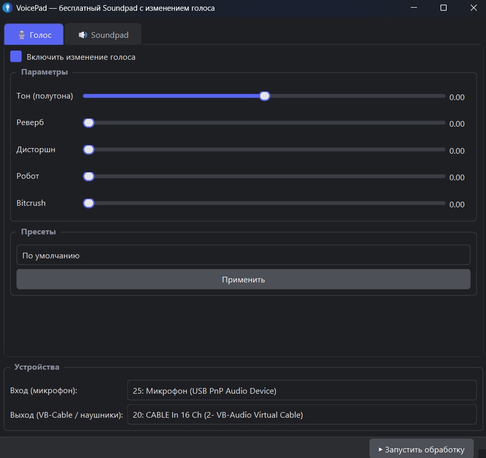
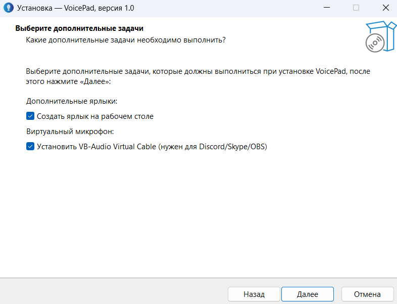

# 🎤 VoicePad

**Бесплатный аналог Soundpad с изменением голоса в реальном времени.**

Программа для изменения голоса в реальном времени и воспроизведения звуков в микрофон. Работает с Discord, Skype, Zoom, OBS и играми через виртуальный аудиокабель VB-CABLE.

---

## ✨ Возможности

### 🎙 Изменение голоса в реальном времени
* **Тон** — сдвиг высоты от -12 до +12 полутонов.
* **Реверберация** — эффект большого помещения.
* **Дисторшн** — жёсткое искажение для эффекта «монстра».
* **Робот** — кольцевая модуляция.
* **Bitcrush** — лоу-фай звук, эффект «телефона».

### 🎛 Готовые пресеты
* Женский / Мужской голос.
* Монстр.
* Робот.
* Телефон.

### 🔊 Soundpad
* **Поддержка форматов** — загрузка звуков из mp3, wav, flac, ogg, m4a, aac, opus.
* **Воспроизведение** — трансляция аудиофайлов напрямую в микрофон.
* **Горячие клавиши** — (F1–F12, Ctrl+1 и т.д.) работают даже из свёрнутого окна.
* **Микширование** — воспроизведение нескольких звуков одновременно и зацикливание.

### 💾 Удобство
* **Интерфейс** — тёмная тема в стиле Discord.
* **Автосохранение** — автоматическое сохранение настроек и добавленных звуков.
* **Портативность** — один `.exe`-установщик, не требующий настройки окружения.

---

## 🚀 Быстрый старт

1. **Скачай установщик** [`VoicePad_Setup.exe`](https://github.com) (или возьми файлы из этого репозитория).
2. **Установи VB-CABLE** (обязательно, если еще не установлен):
   * Скачай вручную с официального сайта: [vb-audio.com/Cable](https://vb-audio.com/Cable/)
   * Запусти установщик **от имени администратора**.
   * Перезагрузи компьютер.
3. **Запусти VoicePad** и выберите устройства:
   * **Вход (микрофон)** — твой физический микрофон.
   * **Выход** — `CABLE Input (VB-Audio Virtual Cable)`.
4. Нажми кнопку **«Запустить обработку»**.
5. **Настройка в Discord / играх:** Открой Настройки → Голос и видео → Установи **Устройство ввода (микрофон) = `CABLE Output`**.

---

## 🎧 Мониторинг (Как слышать себя)

Чтобы проверить, как звучит твой измененный голос:
1. Нажми комбинацию клавиш `Win + R`, введи `mmsys.cpl` и нажмите Enter.
2. Перейди на вкладку **«Запись»**.
3. Найдите **`CABLE Output`**, нажмите по нему правой кнопкой мыши и выберите **«Свойства»**.
4. Перейди на вкладку **«Прослушивать»**.
5. Отметь галочкой пункт **«Прослушивать с данного устройства»** и выберите свои наушники.

⚠️ **Важно:** Включайте мониторинг **только в наушниках**! Если звук пойдет через колонки, возникнет жесткий писк (акустическая петля).

---

## 📸 Скриншоты

🖼 *Интерфейс программы VoicePad*

⚙️ *Процесс установки*

---

## ⚙️ Настройки и удаление

* **Конфигурация:** Все настройки программы хранятся по пути `%APPDATA%\VoicePad\config.json`
* **Звуки:** Загруженные аудиофайлы копируются в папку `%APPDATA%\VoicePad\sounds\`
* **Удаление:** Программу можно полностью удалить через *Панель управления → Программы и компоненты → VoicePad → Удалить*.
